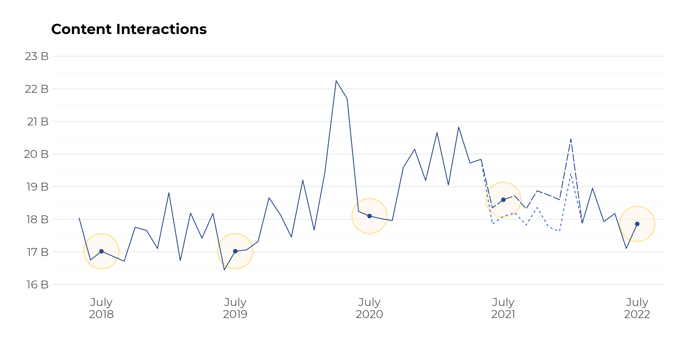

# Data Visualization: Content Interactions

**Phab**: [T314545](https://phabricator.wikimedia.org/T314545)

**Note**: The scripts use the `|>` pipe operator available in R 4.1.0 and later. If using older versions of R you would need to change all instances of `|>` to `%>%` (from [magrittr](https://magrittr.tidyverse.org/) package, available as part of [tidyverse](https://www.tidyverse.org/)).

## Table of Contents

- [data-metrics.R](scripts/data-metrics.R) reads the data and creates a `metrics` tibble
- [data-annotations.R](scripts/data-annotations.R) creates an `annotations` tibble out of `metrics`
- [data-colors.R](scripts/data-colors.R) creates a `wmf_colors` based on colors in the [Wikimedia Design Visual Style Guide](https://design.wikimedia.org/style-guide/visual-style_colors.html)
- [viz-chart.R](scripts/viz-chart.R) creates [chart.png](figures/chart.png) out of `metrics` and `annotations`, using `wmf_colors`
    - [viz-ext-ref.R](scripts/viz-ext-ref.R) is a possible extension of the chart that adds a reference line for the previous year
    - [viz-ext-arrows.R](scripts/viz-ext-arrows.R) is a possible extension of the chart that adds red and green arrows for current and previous years to highlight positive and negative month-over-month changes, respectively
